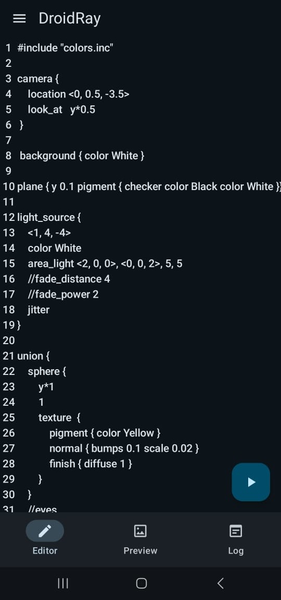
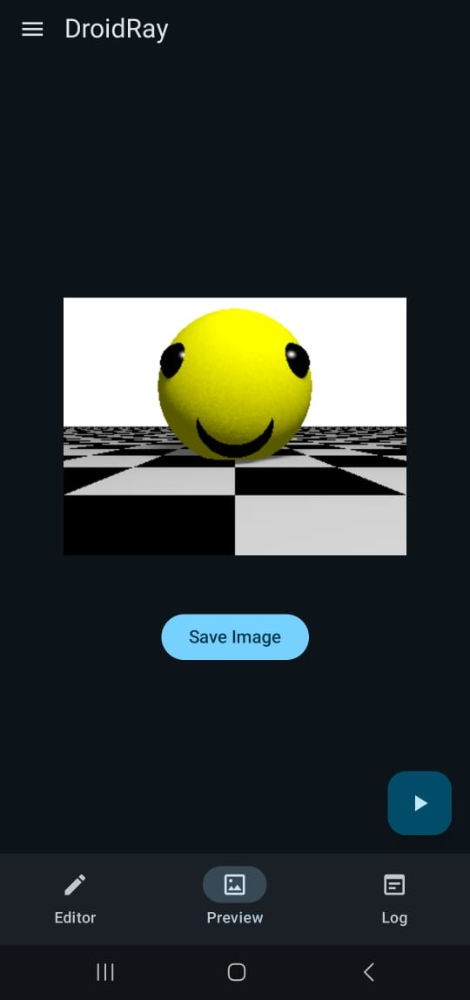
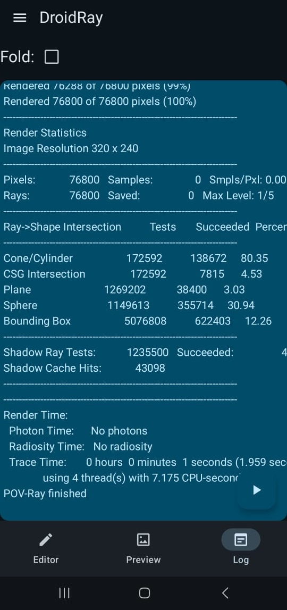

# Android port of POVRay v3.7

  

📥[Download the latest APK release here](https://github.com/FlykeSpice/POVRay-android/releases)

## Features
- Editor with automatic identation support
- Preview for seeing your rendered result along with an option to export them as image
- Logger to see POVRay console log for diagnostics

## TODO
- Add support for rendering animations (and exporting them)
- Add syntax highlight for the editor
- Add support for loading multi-file POVRay scenes (hard)
